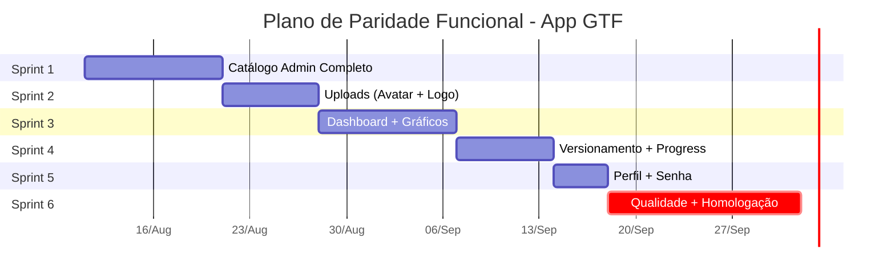

# Plano de Paridade Funcional — App Mobile vs Sistema Web Base

> Mapeamento completo e plano para alinhar o **Sistema-PropostasGTF_App** (mobile) com o **Sistema-Propostas** (web), tornando o aplicativo 100% funcional.
> **Sistema:** GTF Propostas — Sistema Comercial GTF (gestão de propostas comerciais, anunciantes, emissoras e produtos de mídia).

---

## 1. Contexto e Arquitetura

### 1.1 Visão Geral

| | App Mobile (GTF Propostas) | Sistema Web Base |
|---|---|---|
| **Repositório** | [Sistema-PropostasGTF_App](file:///Users/joaomvalente/Projetos/Projetos-GTF/Sistema-PropostasGTF_App) | [Sistema-Propostas](file:///Users/joaomvalente/Projetos/Projetos-GTF/Sistema-Propostas) |
| **Stack** | React Native + Expo SDK 54, Expo Router, TanStack Query, Zustand | React (Vite), Express, Prisma ORM |
| **Código Mobile** | `artifacts/mobile/` | — |
| **API Compartilhada** | Consome via HTTP | `artifacts/api-server/` |
| **Banco de Dados** | **NÃO tem banco próprio** — consome API REST | PostgreSQL + Prisma (`lib/db/`) |
| **Auth** | Access Token + Refresh Token via endpoints `/api/auth/mobile/*` | JWT + Session via `/api/auth/*` |
| **Frontend Web** | — | `artifacts/proposta/` |

### 1.2 Princípio Arquitetural Fundamental

> [!IMPORTANT]
> O app mobile **não é um segundo backend**. Ele é estritamente um **cliente HTTP** da API oficial localizada em `Sistema-Propostas/artifacts/api-server/`. Qualquer mudança de schema, migration ou endpoint deve ser feita no projeto principal `Sistema-Propostas`.

### 1.3 Stack Mobile Detalhada

| Camada | Tecnologia |
|---|---|
| Runtime | Expo SDK 54 |
| UI | React Native 0.81 (Nova Arquitetura) |
| Linguagem | TypeScript + React 19 |
| Navegação | Expo Router (file-based routing) |
| Estado Servidor | TanStack Query (React Query) |
| Estado Auth | Zustand |
| Tokens | Expo SecureStore |
| Cache Local | AsyncStorage (dados não sensíveis) |
| Formulários | React Native Keyboard Controller |
| Tipografia | Fonte Inter (Expo Google Fonts) |
| Identidade | URL Scheme: `gtfpropostas` |

---

## 2. Mapeamento Completo — Estado Atual

### 2.1 Módulo de Autenticação e Sessão

| # | Funcionalidade | Web | Mobile | Status |
|---|---|---|---|---|
| 1 | Login (email/senha) | ✅ | ✅ | ✅ Paridade |
| 2 | Logout com revogação de Refresh Token | ✅ | ✅ | ✅ Paridade |
| 3 | Registro de novo usuário comercial | ✅ | ✅ (status pendente) | ✅ Paridade |
| 4 | Recuperação de senha (solicitar e-mail) | ✅ | ✅ | ✅ Paridade |
| 5 | Redefinição de senha (via deep link) | ✅ | ✅ (⚠️ validar device real) | 🟡 Validar |
| 6 | Token refresh single-flight | ✅ | ✅ | ✅ Paridade |
| 7 | Restauração de sessão na inicialização | ✅ | ✅ | ✅ Paridade |
| 8 | Guard de rotas por perfil (Admin/Comercial) | ✅ | ✅ (`routeGuard.ts`) | ✅ Paridade |

---

### 2.2 Módulo de Propostas (Core Business)

| # | Funcionalidade | Web | Mobile | Status |
|---|---|---|---|---|
| 9 | Board Kanban de propostas (colunas por etapa/programa) | ✅ | ✅ (`board/`) | ✅ Paridade |
| 10 | Progress Board (Kanban de progresso) | ✅ | ❌ | 🔴 Gap |
| 11 | Criação de proposta (vincular Empresa, Tipo, Cliente/Lead) | ✅ | ✅ (`proposal/new.tsx`) | ✅ Paridade |
| 12 | Editor de proposta em 5 etapas (Contexto, Período, Produtos, Investimento, Revisão) | ✅ | ✅ (`editor/`) | ✅ Paridade |
| 13 | Gestão de produtos na proposta (catálogo + avulso) | ✅ | ✅ (`products/`) | ✅ Paridade |
| 14 | Metadados de produto (duração, horário, sazonalidade) | ✅ | ✅ | ✅ Paridade |
| 15 | Sugestão de investimento | ✅ | ✅ | ✅ Paridade |
| 16 | Alteração de status da proposta | ✅ | ✅ | ✅ Paridade |
| 17 | Timeline de andamento (histórico) | ✅ | ✅ | ✅ Paridade |
| 18 | Duplicação de proposta | ✅ | ✅ | ✅ Paridade |
| 19 | Geração de PDF A4 paginado | ✅ | ✅ (`print/`, Expo Print) | 🟡 Validar device |
| 20 | Compartilhamento nativo | N/A Web | ✅ (Expo Sharing) | 🟡 Validar device |
| 21 | Filtros dinâmicos por status (vindos do Dashboard) | ✅ | ✅ | ✅ Paridade |
| 22 | Versionamento de propostas | ✅ | ❌ | 🔴 Gap |

---

### 2.3 Módulo de Clientes/Leads (Anunciantes)

| # | Funcionalidade | Web | Mobile | Status |
|---|---|---|---|---|
| 23 | Listagem de clientes | ✅ | ✅ | ✅ Paridade |
| 24 | Listagem de leads | ✅ | ✅ (tab separada) | ✅ Paridade |
| 25 | Detalhe e edição de cliente/lead | ✅ | ✅ (`advertiser/[id].tsx`) | ✅ Paridade |
| 26 | Cadastro de lead (origem obrigatória) | ✅ | ✅ (`advertiser/new.tsx`) | ✅ Paridade |
| 27 | Propostas vinculadas ao cliente | ✅ | ✅ (`AdvertiserProposalList`) | ✅ Paridade |
| 28 | Flag `viewerCanEdit` (permissões por campo) | ✅ | ✅ | ✅ Paridade |
| 29 | Busca e filtros avançados de clientes | ✅ | ⚠️ Parcial | 🟡 Parcial |
| 30 | Promoção de Lead → Cliente | ✅ (Admin) | ❌ (bloqueado para Comercial) | 🟡 Verificar Admin |

---

### 2.4 Módulo de Recaptura (Recall Reminders)

| # | Funcionalidade | Web | Mobile | Status |
|---|---|---|---|---|
| 31 | Listagem de avisos de recaptura | ✅ | ✅ | ✅ Paridade |
| 32 | Conclusão de aviso | ✅ | ✅ | ✅ Paridade |
| 33 | Adiamento (7, 15 ou 30 dias) | ✅ | ✅ | ✅ Paridade |
| 34 | Bottom sheet de recaptura após login | N/A Web | ✅ | ✅ Extra Mobile |
| 35 | Contagem de avisos pendentes (badge) | ✅ | ⚠️ Parcial | 🟡 Parcial |

---

### 2.5 Módulo Dashboard

| # | Funcionalidade | Web | Mobile | Status |
|---|---|---|---|---|
| 36 | Dashboard Admin (métricas + propostas recentes) | ✅ | ✅ | ✅ Paridade |
| 37 | Dashboard Comercial | ✅ | ✅ | ✅ Paridade |
| 38 | Métricas de captação por Origem de Lead | ✅ | ✅ (Admin) | ✅ Paridade |
| 39 | Uso de templates (template-usage) | ✅ | ❌ | 🔴 Gap |
| 40 | Gráficos avançados (tendências, distribuição) | ✅ | ❌ | 🔴 Gap |

---

### 2.6 Módulo Administrativo

| # | Funcionalidade | Web | Mobile | Status |
|---|---|---|---|---|
| 41 | Gestão de Usuários (CRUD) | ✅ | ✅ (`admin/users/`) | ✅ Paridade |
| 42 | Matriz de acessos por Empresa | ✅ | ✅ (`admin/users/[id]`) | ✅ Paridade |
| 43 | Gestão de Empresas/Estações (CRUD) | ✅ | ✅ (`admin/stations/`) | ✅ Paridade |
| 44 | Cor temática e apresentação padrão por empresa | ✅ | ✅ | ✅ Paridade |
| 45 | Upload de logo da empresa | ✅ | ❌ | 🔴 Gap |
| 46 | CRUD de Programas | ✅ | ✅ (`admin/programs/`) | ✅ Paridade |
| 47 | CRUD de Produtos (com empresa e valor sugerido) | ✅ | ✅ (`admin/products/`) | ✅ Paridade |
| 48 | CRUD de Tipos de Proposta | ✅ | ✅ (`admin/proposal-types/`) | ✅ Paridade |
| 49 | CRUD de Origens de Lead | ✅ | ✅ (`admin/lead-sources/`) | ✅ Paridade |
| 50 | Métricas de captação por origem | ✅ | ✅ | ✅ Paridade |
| 51 | Gestão de Categorias de Proposta | ✅ | ❌ | 🔴 Gap |
| 52 | Gestão de Templates de Proposta | ✅ | ❌ | 🔴 Gap |
| 53 | Durações de Produto | ✅ | ❌ | 🔴 Gap |
| 54 | Itens de Apresentação da Emissora | ✅ | ⚠️ Parcial (edit existe) | 🟡 Parcial |

---

### 2.7 Módulo de Perfil

| # | Funcionalidade | Web | Mobile | Status |
|---|---|---|---|---|
| 55 | Visualização do perfil | ✅ | ✅ | ✅ Paridade |
| 56 | Edição do perfil | ✅ | ✅ | ✅ Paridade |
| 57 | Upload de avatar | ✅ | ❌ | 🔴 Gap |
| 58 | Alteração de senha (logado) | ✅ | ❌ | 🔴 Gap |

---

### 2.8 Infraestrutura e Qualidade

| # | Funcionalidade | Web | Mobile | Status |
|---|---|---|---|---|
| 59 | Contrato OpenAPI formalizado | ✅ | Consome o mesmo | 🟡 Validar completude |
| 60 | Geração automática de tipos (`api-client-react`) | ✅ | ✅ (`@workspace/api-client-react`) | ✅ Paridade |
| 61 | Testes de integração backend | ✅ (37 testes) | — | — |
| 62 | Build EAS (development/preview/production) | N/A | ⚠️ Configurado mas não testado em nuvem | 🟡 Validar |
| 63 | Bundle ID e Package Name | N/A | ✅ (`br.com.grupogtf.propostas`) | ✅ Configurado |
| 64 | Observabilidade/Crash tracking (Sentry) | ✅ | ❌ | 🔴 Gap |
| 65 | OTA Updates policy | N/A | ❌ | 🔴 Gap |
| 66 | Typecheck sem erros | ✅ | ✅ | ✅ Paridade |
| 67 | Testes E2E automatizados | ✅ | ❌ | 🔴 Gap |
| 68 | Homologação em dispositivo físico | N/A | ❌ (não realizada) | 🔴 Gap |

---

### 2.9 Resumo Quantitativo

| Status | Quantidade | % |
|---|---|---|
| ✅ Paridade Completa | 42 | 62% |
| 🟡 Parcial / Precisa Validação | 10 | 15% |
| 🔴 Gap (Não implementado) | 16 | 23% |
| **Total mapeado** | **68** | **100%** |

> [!NOTE]
> O app mobile já tem **62% de paridade completa** com o sistema web — muito mais avançado do que o roadmap inicial sugeria (Plano 002 foi bem executado). Os gaps restantes são predominantemente em **catálogo/templates admin**, **gráficos avançados**, **upload de imagens** e **infraestrutura de qualidade**.

---

## 3. Adaptações Web → Mobile (UX)

| Padrão Web | Adaptação Mobile | Status |
|---|---|---|
| Tabelas com colunas | Cards scrolláveis / FlatList | ✅ Já adaptado |
| Modais/Dialogs | `ConfirmDialog` nativo + Bottom Sheets | ✅ Já adaptado |
| Sidebar com menu | Tab Navigation por perfil (Admin/Comercial) | ✅ Já adaptado |
| Kanban colunas horizontais | Board horizontal com scroll | ✅ Já adaptado |
| Form único longo | Editor em 5 etapas (wizard) | ✅ Já adaptado |
| Notification dropdown | Bottom sheet após login (recaptura) | ✅ Já adaptado |
| Print HTML/CSS | `expo-print` + PDF A4 paginado | ✅ Já adaptado |
| File sharing | `expo-sharing` nativo | ✅ Já adaptado |
| Drag-and-drop upload | **Câmera + Galeria** (`expo-image-picker`) | ❌ Pendente |
| Gráficos (Recharts) | **Victory Native** / `react-native-chart-kit` | ❌ Pendente |
| Progress Board completo | **Scroll horizontal com estados** | ❌ Pendente |

---

## 4. Plano de Implementação — Sprints

### Sprint 1 — Catálogo Admin Completo 🔴
**Duração estimada:** 1.5 semanas | **Impacto:** Médio-Alto

Completar os CRUDs administrativos que existem no web mas faltam no mobile.

| Item | Descrição | Arquivos a criar/modificar |
|---|---|---|
| 1.1 | CRUD de Categorias de Proposta | `app/admin/proposal-categories/index.tsx`, `[id].tsx` |
| 1.2 | CRUD de Templates de Proposta | `app/admin/proposal-templates/index.tsx`, `[id].tsx` |
| 1.3 | Ação "Usar Template" (`POST /:id/use`) | Integrar no fluxo de criação de proposta |
| 1.4 | CRUD de Durações de Produto | `app/admin/product-durations/index.tsx`, `[id].tsx` |
| 1.5 | Completar Itens de Apresentação da Emissora | `app/admin/stations/[id]/presentation.tsx` |
| 1.6 | Menu admin: adicionar links para novos CRUDs | `app/(admin)/menu.tsx` |

**Agentes:** `agent-react-native-expo-engineer`, `agent-mobile-product-manager`

---

### Sprint 2 — Upload de Imagens + Avatar + Logo 🔴
**Duração estimada:** 1 semana | **Impacto:** Médio

| Item | Descrição | Arquivos |
|---|---|---|
| 2.1 | Upload de avatar do usuário (câmera + galeria) | `components/AvatarPicker.tsx`, atualizar tela de perfil |
| 2.2 | Upload de logo da empresa | Atualizar `app/admin/stations/[id].tsx` |
| 2.3 | Integração com `expo-image-picker` | `src/utils/imagePicker.ts` |
| 2.4 | Upload multipart/form-data via API | `src/api/upload.ts` |

**Agentes:** `agent-react-native-expo-engineer`, `agent-mobile-ux-ui-designer`, `agent-mobile-api-integration-engineer`

---

### Sprint 3 — Dashboard Avançado + Gráficos 🟠
**Duração estimada:** 1.5 semanas | **Impacto:** Médio

| Item | Descrição | Arquivos |
|---|---|---|
| 3.1 | Gráficos de tendência mensal | `components/dashboard/TrendChart.tsx` |
| 3.2 | Distribuição por status (pizza/donut) | `components/dashboard/StatusChart.tsx` |
| 3.3 | Uso de templates (ranking de utilização) | `components/dashboard/TemplateUsage.tsx` |
| 3.4 | Integrar endpoint `GET /dashboard/template-usage` | `src/api/` ou via `api-client-react` |
| 3.5 | Instalar e configurar `victory-native` ou `react-native-chart-kit` | `package.json` |

**Agentes:** `agent-react-native-expo-engineer`, `agent-mobile-ux-ui-designer`

> [!IMPORTANT]
> **Decisão UX:** Gráficos no mobile devem ser simplificados e interativos (touch-friendly). Recomendo `victory-native` pela integração com `react-native-svg` e suporte a animações.

---

### Sprint 4 — Propostas: Versionamento + Progress Board 🟠
**Duração estimada:** 1 semana | **Impacto:** Médio

| Item | Descrição | Arquivos |
|---|---|---|
| 4.1 | Visualizar versões anteriores da proposta | `components/proposals/VersionHistory.tsx` |
| 4.2 | Integrar `GET /proposals/:id/versions` | Já disponível via `api-client-react` |
| 4.3 | Progress Board (visualização de progresso por etapa) | `app/(comercial)/progress.tsx` ou sub-view |
| 4.4 | Integrar `GET /proposals/progress-board` | Já disponível via `api-client-react` |

**Agentes:** `agent-react-native-expo-engineer`, `agent-mobile-api-integration-engineer`

---

### Sprint 5 — Perfil Completo + Alteração de Senha 🟡
**Duração estimada:** 0.5 semana | **Impacto:** Médio

| Item | Descrição | Arquivos |
|---|---|---|
| 5.1 | Alteração de senha (logado) | `app/(comercial)/profile.tsx` ou sub-tela |
| 5.2 | Integrar endpoint de alteração de senha | `src/api/` |
| 5.3 | Validação de senha forte (Zod) | `src/api/schemas.ts` |

**Agentes:** `agent-react-native-expo-engineer`, `agent-mobile-security-engineer`

---

### Sprint 6 — Infraestrutura, Qualidade e Homologação 🔵
**Duração estimada:** 2 semanas | **Impacto:** Muito Alto

| Item | Descrição |
|---|---|
| 6.1 | Configurar Sentry (crash tracking + observabilidade) |
| 6.2 | Definir política de OTA Updates |
| 6.3 | Validar deep link de redefinição de senha em device real |
| 6.4 | Validar PDF A4 + compartilhamento em iOS e Android reais |
| 6.5 | Executar e validar builds EAS preview na nuvem |
| 6.6 | Testes E2E com Maestro (fluxos críticos) |
| 6.7 | Homologação completa em dispositivos físicos |
| 6.8 | Testar com diferentes condições de rede (3G, offline, Wi-Fi) |
| 6.9 | Testar com perfis Admin e Comercial |
| 6.10 | Validar badge de recaptura no tab bar |
| 6.11 | Validar filtros avançados de clientes |
| 6.12 | Validar promoção de Lead → Cliente (Admin) |

**Agentes:** `agent-mobile-qa-engineer`, `agent-mobile-security-engineer`, `agent-mobile-devops-release-engineer`

> [!CAUTION]
> Nenhuma feature do app foi validada em dispositivo físico ainda (apenas simuladores). A Sprint 6 é **crítica** para garantir que o app funcione corretamente antes da publicação.

---

## 5. Gaps Detalhados que Precisam de Validação (🟡)

Estes itens estão implementados mas precisam ser testados/completados:

| # | Item | O que precisa | Como validar |
|---|---|---|---|
| 5 | Deep link reset-password | Testar em iOS/Android real | Enviar e-mail e clicar no link no dispositivo |
| 19 | PDF A4 paginado | Layout pode quebrar em certos devices | Gerar PDF com proposta grande (12+ produtos) |
| 20 | Compartilhamento nativo | Pode falhar em Android específicos | Testar share sheet com PDF em 3+ devices |
| 29 | Filtros de clientes | Verificar se todos os filtros da API são usados | Comparar com filtros do web |
| 30 | Promoção Lead → Cliente | Verificar se admin mobile tem a ação | Testar com perfil Admin |
| 35 | Badge de recaptura | Pode não atualizar em tempo real | Criar aviso e verificar badge |
| 54 | Itens de apresentação | Verificar completude do CRUD | Comparar com web |
| 59 | Contrato OpenAPI | Verificar se todos endpoints estão formalizados | Diff openapi.yaml vs rotas reais |
| 62 | Build EAS | Nunca testado em nuvem | Executar `eas build --profile preview` |

---

## 6. Open Questions

> [!IMPORTANT]
> ### Perguntas que impactam a implementação:
>
> 1. **Templates de Proposta no Mobile:** O CRUD completo de templates (criar, editar, listar, usar) deve existir no mobile ou apenas a ação "Usar Template" ao criar uma proposta?
>
> 2. **Progress Board:** Deve ser uma view separada com sua própria tab/rota, ou um modo de visualização alternativo dentro do board existente?
>
> 3. **Gráficos no Dashboard:** Quais gráficos são mais úteis para o uso em campo? O vendedor precisa ver tendências mensais no celular, ou isso é mais relevante para o admin?
>
> 4. **Alteração de senha no mobile:** Deve ser acessível pela tela de perfil (recomendado) ou ter uma tela separada?
>
> 5. **Prioridade dos sprints:** A ordem (Catálogo Admin → Uploads → Dashboard → Versionamento → Perfil → Qualidade) está alinhada? Ou devemos priorizar a Sprint 6 (qualidade/homologação) antes dos novos recursos?
>
> 6. **Escopo de relatórios:** O web tem algum módulo de relatórios/exportação além das métricas de Dashboard? Se sim, deve ser portado para mobile?

---

## 7. Dependências e Novas Libs

| Pacote | Uso | Sprint |
|---|---|---|
| `victory-native` | Gráficos no dashboard | Sprint 3 |
| `expo-image-picker` | Upload de fotos (avatar/logo) | Sprint 2 |
| `expo-file-system` | Manipulação de arquivos | Sprint 2 |
| `@sentry/react-native` | Crash tracking | Sprint 6 |
| `maestro` (CLI) | Testes E2E | Sprint 6 |

> [!NOTE]
> O projeto já inclui: `expo-print`, `expo-sharing`, `expo-secure-store`, `expo-image`, `@tanstack/react-query`, `zustand`, `zod`, `react-native-svg` — essas dependências **não precisam ser adicionadas**.

---

## 8. Verificação

### Comandos de Validação

```bash
# Typecheck
pnpm --filter @workspace/mobile run typecheck

# Testes unitários
pnpm --filter @workspace/mobile test

# Build de teste
EXPO_PUBLIC_API_URL=https://propostasmosaico-one.vercel.app/api \
  pnpm --filter @workspace/mobile exec expo export \
  --platform ios --platform android --output-dir dist-test

# EAS Preview Build
eas build --profile preview --platform all
```

### Matriz de Homologação

| Cenário | iOS | Android |
|---|---|---|
| Login/Logout/Refresh | ⬜ | ⬜ |
| Board de propostas (scroll/drag) | ⬜ | ⬜ |
| Criar proposta (5 etapas) | ⬜ | ⬜ |
| PDF + Compartilhamento | ⬜ | ⬜ |
| Recaptura bottom sheet | ⬜ | ⬜ |
| CRUDs Admin | ⬜ | ⬜ |
| Deep link reset-password | ⬜ | ⬜ |
| Rede 3G / offline | ⬜ | ⬜ |
| Font scaling (acessibilidade) | ⬜ | ⬜ |
| Perfil Admin vs Comercial | ⬜ | ⬜ |

---

## 9. Resumo Executivo



**Esforço total estimado:** ~8 semanas
- **16 gaps** a resolver + **10 itens a validar**
- ~12 novas telas/componentes
- ~5 novos serviços/integrações
- 1 fase completa de homologação em devices reais

> [!TIP]
> O Plano Mobile 002 foi muito bem executado — o app já tem 62% de paridade. Os gaps restantes são predominantemente de **catálogo avançado**, **gráficos**, **upload de imagens** e **homologação em dispositivos reais**. Recomendo considerar priorizar a Sprint 6 (qualidade) em paralelo com as features, para não acumular dívida técnica de homologação.

---

## 10. Checklist de Execução — 07/08/2026

### Implementado nesta rodada

- [x] Criado utilitário mobile de seleção de imagem com `expo-image-picker` em `src/utils/imagePicker.ts`.
- [x] Criado componente reutilizável `ImagePickerField` para avatar/logo em base64.
- [x] Perfil do usuário, Admin e Comercial, agora permite selecionar/remover `avatarBase64`.
- [x] Cadastro/edição de Empresa agora permite selecionar/remover `logoBase64`.
- [x] Criada tela Admin de **Durações de Produto** em `app/admin/product-durations/index.tsx`.
- [x] Criada tela Admin de **Modelos de Proposta** em `app/admin/proposal-templates/index.tsx`.
- [x] Menu Admin atualizado com **Durações de Produto** e **Modelos de Proposta**.
- [x] Tela de detalhe da proposta passou a exibir o histórico de versões via `GET /proposals/:id/versions`.
- [x] Tipos mobile atualizados com `ProposalTemplate`, `ProposalTemplateProduct`, `ProposalVersion` e campos completos de `ProductDuration`.

### Validações executadas

- [x] `pnpm --filter @workspace/mobile run typecheck`
- [x] `pnpm --filter @workspace/mobile test`
- [x] `EXPO_PUBLIC_API_URL=https://propostasmosaico-one.vercel.app/api pnpm --filter @workspace/mobile exec expo export --platform ios --platform android --output-dir dist-test`

### Pendências controladas

- [ ] **CRUD completo de Durações:** a API atual expõe `GET /product-durations` e `POST /product-durations`, mas não expõe `PATCH/DELETE`; por isso a tela mobile implementa listagem e criação, sem edição/exclusão.
- [ ] **Categorias de Proposta:** no sistema atual, `proposal-categories` já é usado como **Programas** no app; não foi criada uma tela duplicada para evitar confusão de domínio.
- [ ] **Templates com produtos completos:** a tela permite criar/editar dados principais e usar o modelo; editor completo de produtos do template fica como próxima etapa por exigir UX própria.
- [ ] **Alteração de senha logado:** não há endpoint `/profile/change-password` ou equivalente na API atual; fluxo público de recuperação já existe e continua sendo o caminho disponível.
- [ ] **Dashboard com gráficos:** mantido pendente para não adicionar biblioteca nova sem decisão (`victory-native` vs `react-native-chart-kit`).
- [ ] **Sentry, EAS preview, Maestro e homologação física:** pendentes por dependerem de configuração externa e validação em dispositivo real.
