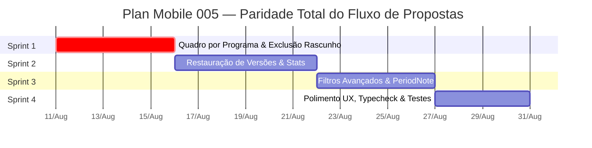

# Plan Mobile 005 — Paridade Total do Fluxo de Propostas (Web vs. Mobile)

> **Objetivo:** Alinhar 100% do fluxo de vida de **Propostas** do aplicativo mobile (`Sistema-PropostasGTF_App`) com a aplicação Web oficial (`Sistema-Propostas`), eliminando todas as divergências, lacunas e não-conformidades funcionais e de UX.

---

## 1. Contexto e Referências

Com base na revisão da arquitetura oficial registrada em `docs-mobile/README.md` e nos papéis especializados em `.agents` e `agents-mobile`:

- **API Única Backend:** `/api/proposals` em `Sistema-Propostas/artifacts/api-server/src/routes/proposals.ts`.
- **Fonte de Verdade do Fluxo Comercial:** Aplicação Web em `Sistema-Propostas/artifacts/proposta/src/pages/proposals/`.
- **Diretório do Plano:** `Sistema-PropostasGTF_App/plans-mobile/plan-mobile-005-fluxo-propostas-paridade-total.md`.

---

## 2. Mapeamento Comparativo: Fluxo Web vs. Mobile Atual

### 2.1 Matriz de Paridade Funcional

| Funcionalidade / Etapa | Comportamento no Sistema Web | Comportamento no App Mobile Atual | Diagnóstico / Lacuna |
|---|---|---|---|
| **1. Quadro por Programa (`Program Board`)** | Exibe propostas agrupadas por programas da rádio/TV, mostrando cor da estação, total R$ investido por programa e quantidade de propostas | O mobile só possui o `Progress Board` (kanban de etapas da timeline) | 🔴 **Faltando no Mobile** |
| **2. Quadro de Progresso (`Progress Board`)** | Drag-and-drop nativo entre etapas, atualizando a timeline (`POST /proposals/:id/timeline`) | Pager horizontal por etapa + lista vertical, com modal para mover etapa | 🟢 **Conforme (Adaptado)** |
| **3. Exclusão de Proposta Rascunho** | Permite excluir propostas em rascunho via `DELETE /api/proposals/:id` com confirmação | Não possui botão de exclusão de proposta na UI | 🔴 **Faltando no Mobile** |
| **4. Filtros Avançados de Propostas** | Filtra por intervalo de datas (`dateFrom`, `dateTo`), Vendedor (`createdById`), Tipo de Proposta (`proposalTypeId`) e Estação | Possui apenas busca por texto livre e chips de programas | 🟠 **Incompleto no Mobile** |
| **5. Criação de Novo Lead durante Proposta** | Modal inline que cria o Lead e o auto-seleciona na nova proposta imediatamente | Navega para `/advertiser/new`, perdendo a seleção ao retornar | 🟠 **Ajustar UX no Mobile** |
| **6. Inspeção e Restauração de Versões** | Lista histórico de versões, permite visualizar o snapshot de qualquer versão e **restaurar** para aquela versão | Apenas lista datas de versões em acordeão estático | 🔴 **Faltando no Mobile** |
| **7. Edição de Stats / Apresentação da Emissora** | Permite editar os 4 blocos de dados de apresentação (Alcance, Audiência, etc.) por proposta | Puxa da estação e renderiza no PDF, mas não é editável no app | 🔴 **Faltando no Mobile** |
| **8. Campo Nota do Período (`periodNote`)** | Permite preencher observações do período (ex: "Veiculação de seg a sex") exibidas no PDF | Campo omitido no editor e no PDF do mobile | 🟠 **Incompleto no Mobile** |
| **9. Ações de Status e Regras de Negócio** | `APPROVED` promove Lead a Cliente e cancela recall. `REJECTED` agenda avisos de recall de 3, 6 e 10 meses | Implementado e acionando os endpoints do backend | 🟢 **Conforme** |
| **10. Geração e Compartilhamento de PDF** | HTML paginado dinamicamente com cores de produto, `bannerBase64`, metadados | Implementado via `expo-print` + `expo-sharing` no Plano 004 | 🟢 **Conforme** |

---

## 3. Detalhamento dos Problemas e Ajustes de Conformidade

### 🔴 1. Visualização de Quadro por Programa (`/program-board`)
- **Web Endpoint:** `GET /api/proposals/program-board`
- **Descrição:** O sistema comercial GTF exige acompanhamento das propostas divididas pelos programas comerciais de rádio/TV (ex: "Jornal da Manhã", "Esporte Total", "Sem programa"). Cada bloco de programa exibe o investimento total acumulado e a contagem de propostas ativas.
- **Ação Mobile:** Adicionar seletor de visualização no `ProposalBoardScreen` com 3 modos: `Board (Etapas)`, `Programas (Por Programa)` e `Lista (Tabela)`.

### 🔴 2. Botão de Exclusão de Propostas em Rascunho (`DELETE /api/proposals/:id`)
- **Web Endpoint:** `DELETE /api/proposals/:id`
- **Descrição:** Vendedores e administradores precisam cancelar/excluir propostas em rascunho criadas por engano.
- **Ação Mobile:** Adicionar botão destrutivo "Excluir Rascunho" na etapa de ações da tela `proposal/[id].tsx` (visível apenas se `status === 'DRAFT'` e o usuário tiver permissão `canEdit`).

### 🔴 3. Inspeção e Restauração de Snapshots de Versões
- **Web Endpoints:** `GET /api/proposals/:id/versions` e `GET /api/proposals/:id/versions/:versionId`
- **Descrição:** O histórico de alterações da proposta grava snapshots completos no banco. No web, o usuário clica na versão para comparar ou restaurar.
- **Ação Mobile:** Criar modal `ProposalVersionSheet.tsx` ao clicar em uma versão do acordeão, com resumo do snapshot e botão "Restaurar esta versão".

### 🔴 4. Edição dos 4 Blocos de Apresentação / Stats da Emissora
- **Web Fields:** `stats: Array<{ num: string, suf: string, desc: string }>` em `PATCH /api/proposals/:id`.
- **Descrição:** Cada proposta carrega por padrão os indicadores da rádio (ex: `88.3 FM - Líder de audiência`), mas o vendedor pode customizar esses 4 números para a proposta em negociação.
- **Ação Mobile:** Incluir seção de formulário "Apresentação da Emissora" na etapa `Contexto` da tela `proposal/[id].tsx` para edições rápidas desses 4 itens.

### 🟠 5. Campo `periodNote` (Nota explicativa do Período)
- **Web Fields:** `periodNote` em `PATCH /api/proposals/:id`.
- **Descrição:** Permite incluir texto como "Período sujeito a alterações conforme grade de programação", que é impresso abaixo das datas no PDF.
- **Ação Mobile:** Adicionar o campo `TextInput` para `periodNote` na etapa `period` do editor e incluí-lo na renderização do `proposalPrintHtml.ts`.

### 🟠 6. Modal de Filtros Avançados na Listagem
- **Web Params:** `dateFrom`, `dateTo`, `createdById`, `proposalTypeId`, `stationId`, `status`.
- **Descrição:** Permitir filtrar a listagem por intervalo de datas e vendedor responsável.
- **Ação Mobile:** Criar componente `ProposalFiltersSheet.tsx` acionado pelo botão de filtro no header do `ProposalBoardScreen`.

### 🟠 7. Auto-seleção de Novo Lead na Criação da Proposta
- **Descrição:** Na criação da proposta (`proposal/new.tsx`), quando o usuário clica em "Novo Lead" e conclui o cadastro, ao retornar ele deve ter o novo Lead automaticamente selecionado no formulário.
- **Ação Mobile:** Passar callback/params da rota de criação do lead (`/advertiser/new?selectOnReturn=true`) para selecionar o lead recém-criado na volta.

---

## 4. Plano de Implementação em Sprints



### Sprint 1 — Quadro por Programa & Exclusão de Rascunho 🔴
- [ ] Criar serviço `getProposalProgramBoard()` consumindo `GET /api/proposals/program-board` em `src/features/proposals/api.ts`.
- [ ] Criar componente `ProposalProgramBoardView.tsx` exibindo cards agrupados por Programa com totais financeiros em `R$`.
- [ ] Adicionar alternador de 3 modos no header de `ProposalBoardScreen.tsx`: `Board (Etapas)`, `Programas` e `Lista`.
- [ ] Adicionar mutação `deleteProposalMutation` na tela `proposal/[id].tsx` chamando `DELETE /api/proposals/:id` com confirmação `showConfirm`.

### Sprint 2 — Restauração de Versões & Edição de Apresentação (Stats) 🔴
- [ ] Criar endpoint client `getProposalVersionDetail(id, versionId)` em `src/features/proposals/api.ts`.
- [ ] Criar modal `ProposalVersionSheet.tsx` para visualizar o conteúdo do snapshot da versão selecionada e permitir a restauração.
- [ ] Adicionar campos de edição dos 4 blocos de `stats` (números, sufixo e descrição) na etapa `Contexto` do editor `proposal/[id].tsx`.
- [ ] Conectar os `stats` atualizados ao autosave da proposta.

### Sprint 3 — Filtros Avançados, PeriodNote & UX de Novo Lead 🟠
- [ ] Adicionar campo `periodNote` na etapa `period` de `proposal/[id].tsx` e atualizar `proposalPrintHtml.ts` para imprimi-lo.
- [ ] Criar bottom sheet `ProposalFiltersSheet.tsx` com filtros de Intervalo de Datas (`dateFrom`, `dateTo`), Vendedor (`createdById`) e Tipo.
- [ ] Atualizar `proposal/new.tsx` para interceptar a volta da rota `/advertiser/new` e auto-selecionar o Lead recém-criado.

### Sprint 4 — Validação, Typecheck e Testes 🔵
- [ ] Executar typecheck completo do workspace mobile: `pnpm --filter @workspace/mobile run typecheck`.
- [ ] Rodar suíte de testes unitários: `pnpm --filter @workspace/mobile test`.
- [ ] Testar navegação e operações nos simuladores iOS e Android.

---

## 5. Arquivos a Criar e Modificar

### Novos Arquivos
- `src/features/proposals/board/ProposalProgramBoardView.tsx`
- `src/features/proposals/board/ProposalFiltersSheet.tsx`
- `src/features/proposals/versions/ProposalVersionSheet.tsx`

### Arquivos a Modificar
- `src/features/proposals/api.ts` (novos endpoints de program-board, delete, get version detail)
- `src/features/proposals/board/ProposalBoardScreen.tsx` (integração dos 3 modos de exibição + filtro de datas)
- `app/proposal/[id].tsx` (botão de excluir rascunho, edição de stats, periodNote, restauração de versões)
- `app/proposal/new.tsx` (auto-seleção de lead retornado)
- `src/features/proposals/print/proposalPrintHtml.ts` (inclusão do `periodNote`)

---

## 6. Validação e Qualidade

```bash
# Comandos de verificação obrigatórios
pnpm --filter @workspace/mobile run typecheck
pnpm --filter @workspace/mobile test
```

---

## 7. Checklist de Implementação — 07/08/2026

### Sprint 1 — Quadro por Programa & Exclusão de Rascunho
- [x] Criado `getProposalProgramBoard()` consumindo `GET /api/proposals/program-board`.
- [x] Criado `ProposalProgramBoardView.tsx` com navegação por programas, resumo por programa, total financeiro, contagem de propostas e produtos.
- [x] `ProposalBoardScreen.tsx` agora possui 3 modos: `Etapas`, `Programas` e `Lista`.
- [x] Adicionada mutação `deleteProposal()` no client mobile.
- [x] Tela `proposal/[id].tsx` ganhou ação `Excluir Rascunho`, visível apenas para propostas `DRAFT` editáveis, com confirmação destrutiva.

### Sprint 2 — Versões & Apresentação
- [x] Criado `getProposalVersionDetail(id, versionId)`.
- [x] Criado `ProposalVersionSheet.tsx` para inspecionar snapshot da versão.
- [x] Implementada restauração de versão via `PATCH /proposals/:id` usando o snapshot sanitizado.
- [x] Histórico de versões no detalhe da proposta passou a ser clicável.
- [x] Edição de `stats` no mobile foi completada com número, sufixo e descrição, mantendo limite de 4 itens.

### Sprint 3 — Filtros, Nota de Período & Novo Lead
- [x] Criado `ProposalFiltersSheet.tsx`.
- [x] Filtros aceitos pelo backend (`search`, `stationId`, `programId`, `status`) são enviados para os endpoints.
- [x] Filtros não suportados pelo backend atual (`dateFrom`, `dateTo`, `createdByName`, `proposalTypeName`) são aplicados localmente para evitar erros `400`.
- [x] Campo `periodDesc` foi adicionado na etapa `Período` do editor mobile.
- [x] `proposalPrintHtml.ts` imprime a nota de período quando `showPeriod` está ativo.
- [x] Fluxo `Novo Lead` dentro de `Nova Proposta` retorna para `/proposal/new` com `selectedAdvertiserId` e auto-seleciona o lead criado.

### Sprint 4 — Validação
- [x] Schema de `program-board` adicionado em `src/api/schemas.ts`.
- [x] Contratos mobile atualizados em `src/api/contracts.ts`.
- [x] Teste de schema para `program-board` adicionado.
- [x] Teste de PDF para `periodDesc` adicionado.
- [x] `pnpm --filter @workspace/mobile test` executado com sucesso.
- [x] `pnpm --filter @workspace/mobile run typecheck` executado com sucesso.

### Decisões Técnicas
- [x] O endpoint real do backend não aceita `dateFrom`, `dateTo`, `createdById` nem `proposalTypeId` no board. Para preservar estabilidade e evitar `400`, o app aplica estes filtros localmente com os dados disponíveis (`updatedAt`, `createdByName`, `proposalTypeName`).
- [x] O backend usa `periodDesc`, não `periodNote`. A UI mobile chama o campo de “Nota do período”, mas persiste no campo real `periodDesc`.
- [x] O backend não possui endpoint dedicado de restore de versão. A restauração foi implementada no client com `GET /versions/:versionId` + `PATCH /proposals/:id` com payload permitido pelo schema da API.
